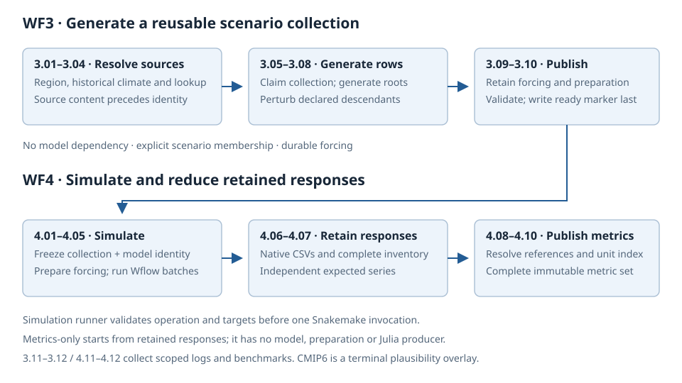
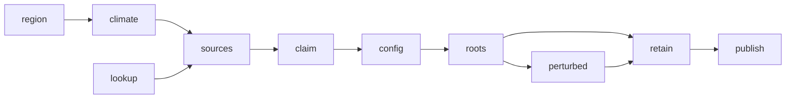

# Rule index — every Snakemake rule

Every rule in `analyze_climate.smk`, `build_model.smk`, `analyze_projections.smk`,
`generate_scenarios.smk` and `simulate_system.smk`: what each one does, what it writes, and how they connect.

Each workflow has a flow description and rule summary; WF0–2 also have detailed
per-rule sections.
**Does** is the rule's job; **Writes** transcribes its `output:` block, so the claim can be
checked against the Snakefile rather than believed.

Rule numbers are reused, so any `W.NN` written before 2026-08-06 names a different
rule — translate through [What changed](#what-changed) before reading one in
`dev/milestones/`, `dev/decisions/`, `dev/LOG.md` or a dated migration record.

## On the numbers

### R12 generation/simulation split

WF3 publishes a ready collection; WF4 consumes it through the mandatory
simulation runner and publishes retained responses and metric sets. The final
rule tables below replace the combined workflow's numbering. Historical tables
in “What changed” retain the numbers in force at their stated dates.

`W.NN` is the rule's position in its workflow's **logical order**: data first,
then model build, then run, then records. Numbering is contiguous within each
workflow and every dependency points from a lower number to a higher one, so a
rule can never depend on something numbered after it.

**"Every dependency low→high" is checked against `input:`, `ancient()`
included.** `ancient()` suppresses the timestamp rerun-trigger; it does not
remove the DAG edge. Two rules move further than a reader of the previous map
would expect for exactly this reason — see the note under the WF1 table.

**Going forward: do not renumber to insert a rule.** Use a letter suffix
(`1.09b`) until the next deliberate sweep. Renumbering is a migration, not an
edit.

## What changed

Dated translations for historical citations. Current WF3/WF4 numbering is in their tables below.

### Renumbering — 2026-08-06 historical map

Read this table before interpreting any `W.NN` in a document written before
2026-08-06. 47 declarations: 18 in WF1, 10 in WF2, 19 in WF3. The `was`
column carries the old name too wherever the rename and the renumber coincide,
so one lookup answers both.


**WF1** — `build_model.smk`

| new | rule | was |
|---|---|---|
| 1.00 | `all` | 1.00 |
| 1.01 | `snapshot_config` | 1.01 |
| 1.02 | `delineate_region` | 1.01b |
| 1.03 | `delineate_spatial_units` | 1.01c |
| 1.04 | `extract_historical_climate` | 1.10 `extract_climate_grid` |
| 1.05 | `plot_climate_source` | 1.15 |
| 1.06 | `prepare_spatial_maps` | 1.02 |
| 1.07 | `build_wflow_model` | 1.03 |
| 1.08 | `add_reservoirs_lakes_glaciers` | 1.04 |
| 1.09 | `declare_wflow_outputs` | 1.05 `add_gauges_and_outputs` |
| 1.10 | `add_climate_forcing` | 1.08 `add_forcing` (+ 1.07, merged in) |
| 1.11 | `write_outlet_index` | 1.06 |
| 1.12 | `plot_basin_map` | 1.12 `plot_map` |
| 1.13 | `plot_forcing` | 1.13 |
| 1.14 | `run_wflow` | 1.09 |
| 1.15 | `plot_wflow_evaluation` | 1.11 `plot_results` |
| 1.16 | `gather_benchmarks` | 1.14 |
| 1.17 | `gather_logs` | 1.16 |

> **Two rules moved further than the previous draft of this table had them, and
> not because of the new rule.** `write_outlet_index` and `plot_basin_map` both
> declare `ancient(<model>/.model_final)`, and that sentinel is written by
> `add_climate_forcing` — so both are downstream of it, and the earlier map,
> which placed them at 1.07 and 1.10 against `add_climate_forcing` at 1.11, had
> two dependencies pointing high→low. The cause is ADR 0004, which moved the
> model root's terminal anchor onto the forcing rule after that map was drawn.
> `ancient()` is why it was easy to miss: it hides the rerun-trigger, not the
> edge.

**WF2** — `analyze_projections.smk`

| new | rule | was |
|---|---|---|
| 2.00 | `all` | 2.00 |
| 2.01 | `snapshot_config` | 2.03 |
| 2.02 | `delineate_region` | 2.03b |
| 2.03 | `delineate_spatial_units` | 2.03c |
| 2.04 | `fetch_gcm_slice` | 2.01 `fetch_gcm_raw` |
| 2.05 | `reduce_gcm_series` | 2.02 |
| 2.06 | `derive_change_factors` | 2.04 |
| 2.07 | `plot_gcm_timeseries` | 2.06 `plot_climate_proj_timeseries` |
| 2.08 | `gather_benchmarks` | 2.10 |
| 2.09 | `gather_logs` | 2.07 |

> **WF2's two gather rules swap relative order**, which is the one cell in this
> table that is a convention choice rather than a derivation. The two are
> parallel leaves — identical `input:` sets, neither consumes the other — so no
> dependency decides it. WF1 and WF3 both define benchmarks first; WF2 defined
> logs first, and nothing recorded why. Ruled 2026-08-06 to follow the other two
> workflows, so the three read alike and `gather_logs` is the last-numbered rule
> everywhere.

**WF3** — `run_stress_test.smk`

| new | rule | was |
|---|---|---|
| 3.00 | `all` | 3.00 |
| 3.01 | `check_project_consistency` | 3.00b |
| 3.02 | `snapshot_config` | 3.01 |
| 3.03 | `delineate_region` | 3.01b |
| 3.04 | `delineate_spatial_units` | 3.01f |
| 3.05 | `write_model_reference` | 3.01c |
| 3.06 | `check_model_reference` | 3.01d |
| 3.07 | `write_experiment_config` | 3.01e |
| 3.08 | `extract_historical_climate` | 3.02 `extract_climate_grid` |
| 3.09 | `prepare_stress_test_grid` | 3.03 `climate_stress_parameters` |
| 3.10 | `prepare_weathergen_config` | 3.04 `prepare_weagen_config` |
| 3.11 | `generate_weather_realizations` | 3.06 `generate_weather_realization` |
| 3.12 | `perturb_climate_realization` | 3.07 `generate_climate_stress_test` |
| 3.13 | `write_climate_data_catalog` | 3.08 `climate_data_catalog` |
| 3.14 | `downscale_climate_realization` | 3.09 |
| 3.15 | `run_wflow_batch_<b>` | 3.10 |
| 3.16 | `derive_wflow_indicators` | 3.11 |
| 3.17 | `gather_benchmarks` | 3.12 |
| 3.18 | `gather_logs` | 3.13 |

> **`3.01f` is gone, and that is what the renumber was for.** The vector rule
> answered to `3.01f` only because `3.01c`–`3.01e` were already taken, so a rule
> that belongs beside `delineate_region` sorted five letters away from it. It is
> now `3.04`, adjacent to `3.03` in all three workflows.

### Twelve renames

| rule | was |
|---|---|
| `declare_wflow_outputs` | `add_gauges_and_outputs` |
| `add_climate_forcing` | `add_forcing` |
| `extract_historical_climate` | `extract_climate_grid` |
| `plot_wflow_evaluation` | `plot_results` |
| `plot_basin_map` | `plot_map` |
| `fetch_gcm_slice` | `fetch_gcm_raw` |
| `plot_gcm_timeseries` | `plot_climate_proj_timeseries` |
| `prepare_stress_test_grid` | `climate_stress_parameters` |
| `prepare_weathergen_config` | `prepare_weagen_config` |
| `generate_weather_realizations` | `generate_weather_realization` |
| `perturb_climate_realization` | `generate_climate_stress_test` |
| `write_climate_data_catalog` | `climate_data_catalog` |

## Conventions

- Every rule also writes a `log:` part and a `benchmark:` part under
  `logs/_parts/` and `benchmarks/_parts/`. Uniform, so not repeated per rule.
- **Writes (undeclared)** is a real disk write that Snakemake does not know
  about. These matter: they are invisible to `--dry-run`, not cleaned by
  `--delete-all-output`, and unusable as a dependency. Three rules mutate
  `wflow_sbm.toml` or `staticmaps.nc` this way, by design — the sentinel pattern
  in the Snakefile comments exists precisely because of it.
- `temp(...)` outputs are deleted once consumed. Sentinels (`.model_built`,
  `.outputs_configured`, `.project_consistency_ok`, `.model_reference_ok`,
  `.guard_ok`) are outputs but not products.

Paths are relative to `project_dir`, with these shorthands:

| shorthand | path |
|---|---|
| `<model>/` | `models/hydrology/wflow/` |
| `<spatial>/` | `data/spatial/` |
| `<store>/` | `data/climate/historical/<clim_source>_<window>/` |
| `<proj>/` | `data/climate/projections/<ensemble>/` |
| `<exp>/` | `experiments/<experiment_name>/` |
| `<wg>/` | `<project>/scenario_plans/<generation_request_id>/generation/` (P2 staging; predecessor captures use `<exp>/climate/weathergenr/`) |
| `<runs>/` | `<exp>/hydrology/wflow/` |

---

# WF0 — historical climate (`analyze_climate.smk`)

Characterises the basin's historical climate from one or more candidate gridded
datasets. **Builds no model** — that is the point: it answers which forcing
dataset a basin should use, before wf1 commits to one.

Ten numbered rules, but not ten rule blocks. `0.04` and `0.05` are declared
inside `for _source in CANDIDATE_SOURCES:` and carry a per-source `name:`
(`extract_historical_climate_<source>`), so their count is a runtime fact.
`0.06` is declared only when more than one candidate source is configured.

`0.07`–`0.09` are RESERVED, not missing: the station-sampling, observation
comparison and Budyko rules land there. Do not renumber the gathers to close the
gap.

```
                    config + data catalogs
                              │
      0.01 snapshot_config ───┤
                              ▼
                    0.02 delineate_region ──► region.geojson
                              │
              ┌───────────────┴───────────────┐
              ▼                               ▼
    0.04 extract_historical_climate   0.03 delineate_spatial_units
      (per source; SHARED store,       (SHARED vectors, = 1.03/2.03/3.04)
       = WF1 1.04)                              │
              │                                 │
              ▼                                 │
    0.04b derive_climate_levels                 │
      (one shared scale, pooled                 │
       across every source)                     │
              │                                 │
              ▼                                 ▼
    0.05 plot_climate_source ◄───────── (subbasin polygons)
      (per source)                              │
              │                                 │
              └───────────────┬─────────────────┘
                              ▼
                    0.06 compare_climate_sources
                     (only when >1 candidate)
                              │
                              ▼
                0.10 gather_benchmarks · 0.11 gather_logs
```

| Banner | Rule | Fan-out |
| --- | --- | --- |
| 0.00 | `all` | — |
| 0.01 | `snapshot_config` | — |
| 0.02 | `delineate_region` | — (shared) |
| 0.03 | `delineate_spatial_units` | — (shared) |
| 0.04 | `extract_historical_climate_<source>` | per candidate source |
| 0.04b | `derive_climate_levels` | — |
| 0.05 | `plot_climate_source_<source>` | per candidate source |
| 0.06 | `compare_climate_sources` | — (only when >1 source) |
| 0.10 | `gather_benchmarks` | — (gather) |
| 0.11 | `gather_logs` | — (gather) |

## WF0 rule detail

#### 0.00 · `all`

**Does.** Target aggregator — declares the WF0 target set (the terminals, plus
the config snapshot, the merged log and the benchmark table).

**Writes.** Nothing of its own.

#### 0.01 · `snapshot_config`

**Does.** Copies the config and the files it references into the project, and
writes the run record.

**Writes.** `config/runs/project_config_analyze_climate.yml` · the run record.

#### 0.02 · `delineate_region`

**Does.** Derives the one project region artifact from hydrography and an
outlet (ADR 0006). Declared from the shared `region_rule` helper, so WF1, WF2
and WF3 declare the same artifact rather than each deriving its own.

**Writes.** `<spatial>/geoms/region.geojson` (the helper's declared outputs).

#### 0.03 · `delineate_spatial_units`

**Does.** Derives the shared vector foundation — basins, subbasins, rivers,
locations and the location registry (ADR 0006 §8). Shared with 1.03 / 2.03 /
3.04 from one helper.

**Writes.** The helper's declared vector outputs under `<spatial>/geoms/`.

#### 0.04 · `extract_historical_climate_<source>` — per candidate source

**Does.** Clips a global climate dataset to the basin and writes that source's
store. One rule per candidate source rather than one wildcard rule: the sources
do not share an output set, so a wildcard rule could not cover both families.
Rule 1.04 declares the same artifact for the primary source.

**Writes.** That source's store outputs, including `climate_nc` and
`basin_cells` — the cells that source's own grid contributes to the basin,
which is the domain later averages reduce over.

**Log.** A directory part, `logs/_parts/0.04_extract_historical_climate/<source>.log`,
because the fan-out width belongs to the rule that owns it.

#### 0.04b · `derive_climate_levels`

**Does.** Pools what every per-source figure would plot and derives one shared
scale, so separate figures can be read against each other. Numbered `0.04b`
rather than renumbering: a letter suffix is the insert convention.

**Writes.** `data/climate/historical/climate_levels.json` — one file for the
whole workflow, not one per source.

#### 0.05 · `plot_climate_source_<source>` — per candidate source

**Does.** Renders the canonical figure set for one source, pinned to 0.04b's
shared scale.

**Writes.** The basin-level figures declared file by file, plus the
per-subbasin set as a `directory(...)` — its members are named for delineation
ids, which are not knowable at parse time.

#### 0.06 · `compare_climate_sources` — only when >1 candidate source

**Does.** Puts every candidate on one axis — one annual and one monthly figure
per variable — plus a summary table of what each source is (resolution,
extracted window, reference) and what it delivers. This is the rule that stops
asking the reader to do the comparing.

**Writes.** The comparison figures and table, plus the per-subbasin comparison
set as a `directory(...)`.

**Not an input: `climate_levels.json`.** The shared scale exists so *separate*
figures can be read against each other; every figure here already carries every
source on one axis, so the edge would buy nothing and would re-fire this rule
whenever the scale moved.

#### 0.10 · `gather_benchmarks`

**Does.** Merges the WF0 benchmark parts into one table.

**Writes.** `benchmarks/wf0_benchmarks.md`.

#### 0.11 · `gather_logs`

**Does.** Merges every WF0 log part into one workflow log, then deletes the
parts. `LOG_RULES` is the merge order and is asserted in rule-number order by
`tests/test_log_rules_contract.py`, so a new logging rule must be registered
there.

**Writes.** `logs/wf0_analyze_climate.log`.

---

# WF1 — model creation (`build_model.smk`)

Builds a distributed Wflow-SBM model from global datasets via hydromt and runs it
once on historical forcing. No calibration — rapid deployment.

An arrow is a **declared** dependency; rules on separate branches run
concurrently. The stages read **data → model → run → records**: nothing that
does not need a built model appears after one, and the numbers now follow.

```
STAGE 1 — DATA   (no model exists yet)
──────────────────────────────────────────────────────────────────
                    config + data catalogs
                              │
      1.01 snapshot_config ───┤
                              ▼
                    1.02 delineate_region ──► region.geojson
                              │
              ┌───────────────┴───────────────┐
              ▼                               ▼
    1.04 extract_historical_climate   1.03 delineate_spatial_units
      (SHARED store, = WF3 3.02)       (SHARED vectors, = 2.03:
              │                         basins, subbasins, rivers,
              ▼                         locations, the registry)
    1.05 plot_climate_source                  │
                                              ▼
                                    1.06 prepare_spatial_maps
                                     (thematic rasters, WF1 only)
STAGE 2 — MODEL BUILD                         │
──────────────────────────────────────────────────────────────────
                                              ▼
                                    1.07 build_wflow_model
                                              │
                                              ▼
                                  1.08 add_reservoirs_lakes_glaciers
                                              │
                                              ▼
                                   1.09 declare_wflow_outputs
                                              │
                                              ▼
                                   1.10 add_climate_forcing
                                     (LAST writer of the model
                                      root — ADR 0004's sentinel)
                                              │
              ┌───────────────┬───────────────┼───────────────┐
              ▼               ▼               ▼               ▼
   1.11 write_outlet   1.12 plot_basin   1.13 plot_forcing  (to stage 3)
        _index              _map

STAGE 3 — RUN + EVALUATE
──────────────────────────────────────────────────────────────────
                         1.14 run_wflow
                               │
                               ▼
               1.15 plot_wflow_evaluation ◄── the store (1.04)

STAGE 4 — RUN RECORDS
──────────────────────────────────────────────────────────────────
      1.16 gather_benchmarks · 1.17 gather_logs   (last: every terminal)
```

**Stages are a reading aid, not a barrier.** Stage 1's climate branch (1.04,
1.05) runs concurrently with everything below it — a cold store extracts while
the model builds. Only the arrows constrain order.

**Three rules hang off 1.10 through `ancient()`, and the diagram draws those
edges as real** — because they are. 1.11, 1.12 and 1.14 all declare
`ancient(<model>/.model_final)`, the terminal build sentinel 1.10 writes.
`ancient()` suppresses the timestamp rerun-trigger and nothing else; the
dependency stands, which is exactly why 1.11 and 1.12 are numbered after 1.10
and not beside 1.07. 1.11 also reads `outlets.geojson` (1.07) and the registry
(1.03), and 1.12 reads `staticmaps.nc` (1.07) — those are the edges the diagram
omits to stay legible, and none of them contradicts the numbering.

**The five leaves.** 1.05, 1.11, 1.12, 1.13 and 1.15 have no downstream rule.
All are members of `WF1_TERMINALS`, so all are `rule all` targets and inputs of
the two gather rules — that is the edge the stage-4 line stands in for. Four are
figures, which are expected to terminate (no rule consumes a `.png`). **1.11 is
the one data leaf**, and its real consumer sits outside the workflow: see its
section below.

`WF1_TERMINALS` has a **sixth** member that is not a leaf —
`<spatial>/spatial_catalog.yml`, listed as one representative of 1.06's
multi-output set so the gather rules wait for it. Its producer feeds 1.07, so it
is a terminal in the target-set sense without being a graph leaf.

**What is NOT a dependency, despite reading like one.** 1.10 does not consume the
climate store: it reads source climate through the data catalog (`-d`), and its
only declared input is 1.09's sentinel — it assembles the forcing recipe itself.
The store reaches WF1's *figures* (1.05, 1.15), never its forcing.

| # | rule | in one line |
|---|---|---|
| 1.00 | `all` | Target aggregator. |
| 1.01 | `snapshot_config` | Snapshots the config and everything it references. |
| 1.02 | `delineate_region` | Delineates the one project extent. |
| 1.03 | `delineate_spatial_units` | The shared vector foundation, and where gauges enter the workflow. |
| 1.04 | `extract_historical_climate` | The shared historical-climate store (= WF3 3.02). |
| 1.05 | `plot_climate_source` | Climate figures on the source grid. |
| 1.06 | `prepare_spatial_maps` | The thematic raster stack and the model-build interface. |
| 1.07 | `build_wflow_model` | Parameterises Wflow-SBM, and where gauges enter the model. |
| 1.08 | `add_reservoirs_lakes_glaciers` | Adds waterbodies. |
| 1.09 | `declare_wflow_outputs` | Declares the `[output.csv]` block: which timeseries Wflow emits. |
| 1.10 | `add_climate_forcing` | Assembles the hydromt recipe and applies it: builds the forcing. |
| 1.11 | `write_outlet_index` | Crosswalk from Wflow outlet IDs to named stations. |
| 1.12 | `plot_basin_map` | Every figure the spatial foundation supports: the basin/DEM map and the thematic family. |
| 1.13 | `plot_forcing` | The same figures on the model's own forcing grid. |
| 1.14 | `run_wflow` | Runs Wflow.jl once. |
| 1.15 | `plot_wflow_evaluation` | The evaluation figures, and the metrics table. |
| 1.16 | `gather_benchmarks` | Merges the timing parts. |
| 1.17 | `gather_logs` | Merges the log parts. |

## WF1 rule detail

#### 1.00 · `all`

**Does.** Target aggregator — declares the WF1 target set (the terminals, plus
the config snapshot, the merged log and the benchmark table) so one
`snakemake all` builds the workflow.

**Writes.** Nothing of its own.

#### 1.01 · `snapshot_config`

**Does.** Copies the config and every file it references into the project,
routed by kind, and writes an immutable content-addressed bundle of the
effective settings (merged config + advanced settings + manifest) so a finished
project can say what it was run with.

**Writes.** `config/runs/project_config_build_model.yml` ·
`config/runs/build_model/<digest>/` (bundle dir).

**Writes (undeclared).** Copies into `config/templates/` (build + waterbodies),
`config/catalogs/` (data catalogs) and `config/basin_data/` (the two optional
basin data inputs — gauge/output locations and the observed series — which live
outside the repo *and* outside `project_dir`).

#### 1.02 · `delineate_region`

**Does.** Delineates the one project **extent** from `shared.basin.region` plus
the data catalog, via hydromt `parse_region_basin` (ADR 0003). Catalog in,
polygon out — model-free. It splits and names nothing: one or several parent
features, no IDs, no gauges. Every downstream extent comes from this artifact,
never from a built model.

**Writes.** `<spatial>/geoms/region.geojson`.

#### 1.03 · `delineate_spatial_units`

**Does.** The **shared** vector foundation — the same rule WF2 declares as 2.03
and is consumed by WF4; splatted from one `spatial_units_rule` helper so the three
declarations cannot drift. Partitions the region into the vector layers every
later join is keyed on, and is where **gauge points enter the workflow**: it
snaps `shared.basin.output_locations` to the river network and partitions each
parent basin into incremental subbasins — gauge-driven where `control` points
exist, automatic otherwise, chosen per basin — creating the `basin_id` →
`subbasin_id` → `wflow_id` identity hierarchy.

Its params are a pure function of `project` + `shared.basin` (ADR 0003 §8b), and
that is a requirement: the projections-only configs carry no
`workflows.build_model` section at all, so a payload drawn from one would
differ per invoking workflow.

**Writes.** `<spatial>/geoms/{basins,subbasins,catchments,rivers,locations}.geojson` ·
`<spatial>/location_registry.csv` · `<spatial>/hydrography.nc`.

`hydrography.nc` is the **seam intermediate** (§8a), not a product: the whole
whole hydrography grid stack crosses the vector/raster boundary in memory, and
re-deriving it in 1.06 would make WF1 read the hydrography twice with two grids
that can drift. It is deliberately absent from `spatial_catalog.yml`.

#### 1.04 · `extract_historical_climate`

**Does.** The **shared** historical-climate store producer — the same rule WF3
declares as 3.08, splatted from one `climate_store_rule` helper so the two
declarations cannot drift. Extracts the configured historical climate for the region and
window, on the source grid, model-free. Its declared inputs are the data catalog
— the store's freshness boundary — and the region polygon.

**Writes.** `<store>/extract_historical.nc`, plus `<store>/orography.nc` on the
chirps branches. The extraction records its own extent in netCDF attributes
(`region_geojson_sha256`, `region_bbox`, `region_source`) rather than in a
sidecar file.

#### 1.05 · `plot_climate_source`

**Does.** The canonical climate figure set on the **source** grid, straight from
the shared store, before any regridding to the model. Its whole subgraph is 1.02
+ 1.04 + this rule, so the figures build with no `<model>/` on disk at all.

**Writes.** `<store>/plots/` — the `figure_names("source")` set.

#### 1.06 · `prepare_spatial_maps`

**Does.** The **raster half** of the spatial foundation, and WF1-only: folds the
thematic layers (`vito` land cover, `modis_lai`, `soilgrids`) onto the grid 1.03
handed it, and writes the model-build interface. The vector layers and the
registry come from 1.03 — declaring the unsplit rule instead would have made a
projections-only run resample all three thematic sources to draw a subbasin
outline (measured 2026-08-06: the split avoids ~71% of that).

The name is narrow — it names one of its three outputs — and was kept
deliberately; `build_spatial_foundation` read less clearly, and `build_` is
reserved here for constructing a *model* (`rule-naming-design.md` amendment 2).

**Writes.** `<spatial>/spatial_maps.nc` · `<spatial>/spatial_catalog.yml` ·
`<spatial>/spatial_report.yml`.

#### 1.07 · `build_wflow_model`

**Does.** Parameterises Wflow-SBM on that spatial foundation via hydromt, then
reopens the written model and verifies its grid and IDs against the spatial
products. Also where **the gauges enter the model**: `setup_gauges` /
`setup_outlets` write the `gauges_locations` and `outlets` maps into staticmaps,
both with `toml_output=None` — maps only, no output declarations. No snapping and
no subcatchment derivation: 1.03 did both.

**Writes.** `<model>/staticmaps.nc` · `<model>/wflow_sbm.toml` ·
`<model>/staticgeoms/region.geojson` · `<model>/staticgeoms/outlets.geojson` ·
`<model>/.model_built` (sentinel).

`wflow_sbm.toml` is created here and then mutated in place by 1.08, 1.09 and
1.10, none of which declare it. That is what the `.model_built` sentinel exists
to handle.

#### 1.08 · `add_reservoirs_lakes_glaciers`

**Does.** Adds waterbodies to the built model (a hydromt update). A temporary
hydromt workaround; can fold back into 1.07 when upstream supports it.

**Writes.** `<model>/staticgeoms/reservoirs_lakes_glaciers.txt`.

**Writes (undeclared).** `<model>/staticmaps.nc` — it commits the waterbody
layers back into the model. That undeclared write is part of why the model-root
readers need a sentinel: Snakemake attributes `staticmaps.nc` to 1.07, so
declaring it there orders nothing after *this* rule.

#### 1.09 · `declare_wflow_outputs`

**Does.** Declares which timeseries Wflow emits — the `[output.csv]` block — for
`outlets` (Q), `gauges_locations` (Q, P) and basin means of any extra
`model.outvars`. It adds **no model data**: 1.07 created both gauge maps with
`toml_output=None`, deferring exactly this step. It also re-checks that the
model's gauge IDs still equal `location_registry.wflow_id`, and fails if either
map is absent.

`declare_` is the verb table's 18th entry, added for this rule: 1.08 and 1.10
add model *data* (waterbody layers, forcing grids), while this changes only what
the engine will emit.

**Writes.** `<model>/.outputs_configured` (sentinel).

**Writes (undeclared).** `<model>/wflow_sbm.toml` — the `[output.csv]` block
itself, via `mod.write()` — and `<model>/staticmaps.nc`, which `mod.close()` must
commit or hydromt leaves the new variables stranded in a `staticmaps_<hash>.nc`
temp file.

The gauge-ID re-check is not redundant with 1.07's identical comparison
(`build_wflow_model.py::_validate_written_model`): 1.08 mutates `staticmaps.nc`
in between, so this copy is what catches corruption from that step.

#### 1.10 · `add_climate_forcing`

**Does.** Two steps in one rule. First assembles the hydromt
recipe: a `steps:` YAML holding `setup_config` (`time.starttime`,
`time.endtime`, `time.timestepsecs`, `input.path_forcing`),
`setup_precip_forcing` and `setup_temp_pet_forcing`, with the PET method and
orography source branched off `climate.selected` and the chunksize sized by
opening the model's staticmaps. Then applies it via `hydromt update wflow_sbm`,
which builds the forcing for the model grid and — through the recipe's
`setup_config` step — writes the run window and forcing pointer into the model
TOML.

The window is `workflows.build_model.simulation_window`, falling back to
`shared.historical_window` when unset (2026-08-10). That is the SIMULATION
period, not the extraction period, and it must sit inside the record.

**Reads the climate store, not the catalog.** This rule declares
`extract_historical.nc` as an input and generates a one-entry catalog
(`config/climate_store_catalog.yml`) pointing hydromt at it, so the forcing is
built from the extraction rule 1.04 already made rather than from a second full
pass over the global dataset. `dem_forcing_fn` still resolves from the main
catalog — the store holds no orography.

**Writes.** `<model>/forcing/inmaps_historical.nc` ·
`<model>/config/build_historical_forcing.yml` (the recipe, kept as provenance of
the model it built) · `<model>/.model_final` (sentinel).

**Writes (undeclared).** `<model>/wflow_sbm.toml` — `time.*` and
`input.path_forcing`.

**This rule is the LAST WRITER of the model root, and `.model_final` is what
says so** (ADR 0004). `hydromt update wflow_sbm` calls `mod.write()`, which
rewrites the whole root — staticmaps, the TOML, every `staticgeoms/` layer. Four
rules (1.11, 1.12, 1.13, 1.14) declare that sentinel `ancient()` to order
themselves behind it, and **that is why they are numbered after this rule**: an
`ancient()` input is a real DAG edge with the timestamp trigger suppressed, not
an absent one. **Residual risk, stated because no test can catch it:** the
sentinel is correct only while this rule remains the last writer. A new rule
that mutates the model after it must take the sentinel with it.

#### 1.11 · `write_outlet_index`

**Does.** Joins Wflow's outlets to the deterministic basin/subbasin/location
identities, so a model output can be traced back to a named station. hydromt
labels outlets with basin-derived subcatchment IDs, which are not the registry's
IDs — this is the crosswalk between them, rebuilt on every run.

**Writes.** `<model>/staticgeoms/outlet_index.csv`.

**Consumed by** — and this is why the rule has no downstream node: **no rule
declares this file as an input.** Its consumers are outside the DAG.

- `dev/scripts/check_baseline.py::_read_discharge_series` uses it to resolve
  *which* `Q_*` column of `output.csv` is the primary outlet, once a project has
  more than one gauge station. It matches `compat_station_name == "wflow_1"`,
  takes that row's `subcatchment_id`, and requires `Q_<id>` to be present.
  Without the file a multi-gauge project fails the baseline gate outright. The
  path is **derived** from the run CSV's location
  (`<run>/../staticgeoms/outlet_index.csv`), not passed — which is exactly why
  Snakemake cannot see the edge.
- `dev/reference/contracts/hydrological-model-seam.md` pins it in `validate_hm3`
  as a persisted model-root artifact.

It is a member of `WF1_TERMINALS`, so it is a `rule all` target and an input of
both gather rules. **Do not prune it as stray output** — `check_baseline.py`'s
own module docstring records that it is fingerprinted beyond `rule all` for this
reason.

**Not merged into 1.09**: its inputs are
`outlets.geojson` and the registry, so it runs in parallel with the waterbody
and output-declaration rules. Merging would serialise a cheap pandas join behind
a hydromt `r+` mutation — it *adds* an edge.

#### 1.12 · `plot_basin_map`

**Does.** Draws every figure the shared spatial foundation supports: `basin_area`
— basin, rivers, gauges and the DEM on one map — plus the thematic family beside
it, the subbasin delineation, land cover, leaf area index and the topsoil
properties.

ONE rule for both, because they are one deliverable. The thematic maps draw the
same vector overlay and deliberately suppress its legend *because* `basin_area`
carries the key; a run that produced one set without the other would ship ten
maps whose linework nothing explains. Both halves are leaves, so splitting them
would duplicate the vector inputs and the plots directory for no scheduling gain.

**Reads.** The spatial foundation only — `hydrography.nc` and the vector layers
from 1.03, and `spatial_maps.nc` from 1.06. The 1.06 edge arrived with the
thematic family; before it, this rule depended on 1.03 alone. It costs nothing,
since 1.06 is upstream of the model build and nothing downstream waits on this
leaf.

ADR 0007 already retired this rule's `staticmaps.nc` read, and with it the
`.model_final` sentinel edge that existed to stop a concurrent `-c 3` run
aborting below Python on an unlocked HDF5 read. It opens no model file at all.

**Writes.** `data/spatial/plots/`, **PNG only**. The vector
deliverable was dropped across the whole figure set because nothing in the
toolbox or the platform read it; 600 dpi at 180 mm carries the figure everywhere
it is used, and not serialising each one twice halves the rule's render time.
`figure_paths()` still takes a `formats` argument, so a caller preparing a
manuscript can ask for a PDF. The thematic list is declared from that function,
the same contract 1.13 has with `climate_figures.figure_names()`.

Not every figure is *declared*. A figure whose source variable is specific to one
catalog source — `soil_depth_to_bedrock`, which reads soilgrids v1.0's own
`BDTICM` filename and has no soilgrids_2020 equivalent — is drawn but left out of
`output:`. Declaring it would fail the RULE on a project that merely chose the
other soil source, which is a workflow crash in exchange for one figure.
`data/spatial/plots/` is a directory in the tree inventory, so the undeclared
renders are still accounted for.

**No title, no overlay key**, on the thematic half only. The filename names the
figure and `basin_area` carries the legend; see `shared/plot_spatial_maps.py`.

#### 1.13 · `plot_forcing`

**Does.** Draws the canonical climate figure set for the model's own forcing —
the same figures 1.05 draws for the source grid, so the two directories answer
"what did the downscaling change?" side by side.

**Writes.** `<model>/forcing/plots/` — the full variable × kind cross-product
from `climate_figures.figure_names("forcing")`, all declared.

#### 1.14 · `run_wflow`

**Does.** Runs Wflow.jl once on that historical forcing, driven by the model's
own TOML.

**Writes.** `<model>/run_default/output.csv` — `temp()`, so a successful run
does not leave it: rule 1.14b derives the readable per-variable tables from it
and rule 1.15 reads it for the metrics, then Snakemake drops it. Run with
`--notemp` to keep it (the baseline gate pins it, and iterating on a 1.15 figure
otherwise re-runs the whole model).

#### 1.15 · `plot_wflow_evaluation`

**Does.** Scores the Wflow run against observations where they exist and draws
the evaluation figures — four sheets per station plus the basin-average series.
One rule, both products.

**Writes.** `<model>/evaluation/performance_metrics.csv` · one
`<var>_basavg.png` per basin-average `model.outvars` entry.

**Writes (undeclared).** Per station, keyed by `wflow_id`:
`hydrograph_<id>`, `signatures_peaks_<id>`, `signatures_lows_<id>` and
`performance_<id>`, one PNG each. Their count is a product of the model
build (outlets and subcatchments), not of config, so they cannot be enumerated
at parse time — and neither can their NAMES, because a wflow_id
is assigned by rule 1.03. Only the hydrograph is drawn without observations; the
other three need them, and the two extremes sheets additionally need a run
longer than a year.

**Why no figure is declared** — figures name a point by its `wflow_id`, as every
other artifact of a run does, so no single figure filename is predictable at parse
time. The metrics table is this rule's terminal in `WF1_TERMINALS` instead. The rename also closed two defects the old key hid: an
outlet and a gauge on one cell were plotted twice under two names, and an
observation at the basin outlet matched nothing at all, because observations are
keyed by `wflow_id` while the outlet series is keyed by its subcatchment id.
`plot_results.resolve_stations` is where both are now handled.

**Why the metrics and the figures share a rule** — `performance_metrics.csv` is
baseline-covered data while the figures are excluded, and the DAG cannot express
that distinction; splitting anyway is not affordable, because the metrics are one `compute_metrics` call *inside* the
figure loop, downstream of the model open, the gauge-name resolution, the merge,
the alignment and the climate-parity transform. Splitting means either
duplicating the parity work or adding a declared intermediate, and the harm it
fixes is a wasted re-run, not a wrong number. **Consequence to know when reading
the `AGENTS.md` validation ladder:** a plot-only edit here still re-runs the
whole rule and rewrites identical metrics, so the gate passes but is not free.

#### 1.16 · `gather_benchmarks`

**Does.** Merges the per-rule timing parts into one table with a rule column and
a TOTAL row, rewritten fresh each run. Takes the terminal set as input, which is
what schedules it last.

**Writes.** `benchmarks/wf1_benchmarks.md`.

#### 1.17 · `gather_logs`

**Does.** Merges every WF1 log part into one workflow log in rule order, then
deletes the parts it consumed and prunes the emptied directories. After a
**partial** re-run the untouched sections are marked "no part from this run" —
the artifact describes the run that produced it, not an accumulated history.

**Writes.** `logs/wf1_build_model.log`.

## Two meanings of "subbasin"

In `shared.basin.region` (rule 1.02) `subbasin:` is **hydromt's** region
keyword — "everything upstream of this point, above `uparea`" — and it selects
the project extent. CST's `subbasins.geojson` (rule 1.03) is a different thing:
the incremental partition *within* that extent. A project can be
`{'basin': ...}` at 1.02 and still have twelve subbasins at 1.03.

## Where a gauge point lives, rule by rule

`shared.basin.output_locations` (`station_name, x, y, location_role[, wflow_id]`) is
consumed once, by 1.03, and everything after that reads its derived identities:

| stage | rule | what happens to the point |
|---|---|---|
| enters | 1.03 `delineate_spatial_units` | snapped to a river cell, given `location_id`/`wflow_id`; a `control` point also becomes a subbasin outlet |
| enters the model | 1.07 `build_wflow_model` | written into `staticmaps.nc` as `gauges_locations`, no TOML output |
| becomes an output | 1.09 `declare_wflow_outputs` | named in `[output.csv]`, so Wflow emits its timeseries |
| becomes joinable | 1.11 `write_outlet_index` | `outlet_index.csv` maps Wflow's subcatchment IDs back to the named station |

---

# WF2 — climate projections (`analyze_projections.smk`)

A plausibility overlay, not a driver. Computes monthly CMIP6 change factors that
situate the stress-test grid in projection space. **Nothing here feeds a
stress-test run.**

No model anywhere in this workflow — it is data end to end.

```
STAGE 1 — DATA
──────────────────────────────────────────────────────────────────
                        config + catalogs
                                │
        2.01 snapshot_config ───┤
                                ▼
                      2.02 delineate_region
                                │  region.geojson
              ┌─────────────────┼─────────────────┬──────────────────┐
              │                 │                 │                  │
  CMIP6 store │ (gs://cmip6)    │                 │                  ▼
              ▼                 │                 │      2.03 delineate_spatial
    2.04 fetch_gcm_slice        │                 │           _units
    (one raw slice per member;  │                 │      (SHARED, = 1.03/3.04.
     the ONLY remote read)      │                 │       A LEAF here: nothing
              │                 │                 │       in WF2 consumes it yet)
              ▼                 │                 │                  │
    2.05 reduce_gcm_series ◄────┘                 │                  │
    (one job per series key, full fan-out)        │                  │
              │                                   │                  │
STAGE 2 — PRODUCT                                 │                  │
──────────────────────────────────────────────────────────────────   │
              ▼                                   │                  │
    2.06 derive_change_factors ◄──────────────────┘                  │
    (ONE job — the workflow's answer)                                │
              │                                                      │
              ├──► summary/*_change_factors_{annual,monthly}.csv     │
              │    composition.csv · provenance.json · report.md     │
              │    plots/overview/change-factor-cloud[-combined].png │
              ▼                                                      │
STAGE 3 — FIGURES + RECORDS                                          │
──────────────────────────────────────────────────────────────────   │
    2.07 plot_gcm_timeseries   (reads 2.05's series, not 2.06)       │
              │                                                      │
              ▼                                                      ▼
    2.08 gather_benchmarks · 2.09 gather_logs ◄───────────────────────
```

The region polygon feeds **four** rules — 2.03, 2.04, 2.05 and 2.06 all declare
it — because stage B recomputes every expected digest, including the polygon
fingerprint. 2.07's edge from 2.06 is an **ordering edge only**; it plots the
per-member series from 2.05 and never opens the change-factor table.

**2.03 is a leaf, and both gather rules declare it explicitly.** Nothing in WF2
consumes the vector layers yet (ADR 0003 §10 leaves the consuming rules
unnamed), so without that edge it would run in parallel with the merge and
strand its log part under `_parts/` — the defect the `LOG_RULES` comments record
three times over. A `rule all` target entry is separately what makes it
reachable at all: an undeclared leaf is simply never scheduled.

| # | rule | in one line |
|---|---|---|
| 2.00 | `all` | Target aggregator. |
| 2.01 | `snapshot_config` | As WF1 1.01. |
| 2.02 | `delineate_region` | As WF1 1.02 — the same artifact. |
| 2.03 | `delineate_spatial_units` | As WF1 1.03 — the same artifacts. A leaf here. |
| 2.04 | `fetch_gcm_slice` | Acquires one raw CMIP6 slice. The only remote read. |
| 2.05 | `reduce_gcm_series` | Stage A: one local slice → one monthly series. |
| 2.06 | `derive_change_factors` | Stage B, one job. WF2's terminal product. |
| 2.07 | `plot_gcm_timeseries` | The eight projection figures. |
| 2.08 | `gather_benchmarks` | Merges the timing parts. |
| 2.09 | `gather_logs` | Merges the log parts. |

## WF2 rule detail

#### 2.00 · `all`

**Does.** Target aggregator — the change-factor summaries plus the projection
plots, the merged log and the benchmark table.

**Writes.** Nothing of its own.

#### 2.01 · `snapshot_config`

**Does.** As WF1 1.01, with the WF2 bins.

**Writes.** `config/runs/project_config_analyze_projections.yml` ·
`config/runs/analyze_projections/<digest>/` (bundle dir).

**Writes (undeclared).** Catalog copies into `config/catalogs/`.

#### 2.02 · `delineate_region`

**Does.** As WF1 1.02 — the same one project region artifact, from the same
shared spec (ADR 0003), which is why a projections-only run does not trigger
a full climate extraction just to learn a basin outline.

**Writes.** `<spatial>/geoms/region.geojson`.

#### 2.03 · `delineate_spatial_units`

**Does.** As WF1 1.03 — the same shared vector foundation, from the same helper.
WF2 declares the **vector half only**: the thematic raster stack stays WF1-only,
so a projections-only run obtains basin and subbasin boundaries without reading
`vito`, `modis_lai` or `soilgrids` at all. That is the whole point of ADR 0003
§8's split — `snakemake -n` on this file must list `delineate_spatial_units` and
no job whose inputs mention those three sources, which is §8's acceptance
assertion.

What it buys WF2: a context map beside the change-factor plots, and the option
of subbasin-resolved indicators. It does not yet **consume** them (§10).

**Writes.** As 1.03.

#### 2.04 · `fetch_gcm_slice`

**Does.** Acquires one raw CMIP6 slice for a (model, scenario, member) key.
**The only rule that reads the remote store.** Split from the reduction because
the costs differ by four orders of magnitude — measured 2026-07-30: ~1142 s to
open a remote source, ~19 s to transfer, ~0.2 s to reduce — so a reducer edit
must not re-download. Its params carry `raw_digest_components`, deliberately
excluding the reducer hash; passing the full set here would silently undo the
split while every test still passed.

**Writes.** `<proj>/raw/<series_key>.nc` — persistent and `update()`-flagged,
because Snakemake removes outputs in `Job.prepare()` and the revalidate-and-skip
cache would otherwise never fire.

#### 2.05 · `reduce_gcm_series`

**Does.** Stage A. Reduces one **local** raw slice to a monthly series over the
region polygon, for its (model, scenario, member) key. One job per key, no edges
between series, no network call.

**Writes.** `<proj>/scalar/<series_key>.nc` — persistent + `update()`, same
reason as 2.04.

#### 2.06 · `derive_change_factors`

**Does.** Stage B, a **single job**: turns every reduced series into the change
factors per model, scenario and horizon. Asserts that the set of series it opens
equals its declared input list, so a model dropped from the config cannot rejoin
through a leftover file, and recomputes every expected digest including the
polygon fingerprint. WF2's terminal product — and, despite the `derive_` name, it
also renders one figure and writes the run's provenance and human-readable
report. Kept as one rule deliberately: the design gives stage B no fan-out.

**Writes.** `<proj>/summary/<ensemble>_change_factors_annual.csv` ·
`_monthly.csv` · `<proj>/summary/composition.csv` ·
`<proj>/summary/provenance.json` · `<proj>/report.md` ·
`<proj>/plots/overview/change-factor-cloud.png`, plus
`overview/change-factor-cloud-combined.png` when more than one horizon is
configured (a single horizon has no cloud travel to show).

#### 2.07 · `plot_gcm_timeseries`

**Does.** Draws the two annual overviews (absolute and anomaly panels) from the
per-member series of 2.05, and one monthly change-factor figure per configured
horizon. Since 2026-08-17 the monthly figures RENDER
`summary/*_change_factors_monthly.csv` rather than recomputing it: that table is
a real input, opened and read. The annual table stays an **ordering edge only**.

**Writes.** Eight PNGs under `<proj>/plots/`, named
`<ensemble>_{precip,temp}_{annual,monthly}_{absolute,change}.png`. All eight
are declared, so none is invisible to Snakemake.

#### 2.08 · `gather_benchmarks`

**Does.** As WF1 1.16, for WF2.

**Writes.** `benchmarks/wf2_benchmarks.md`.

#### 2.09 · `gather_logs`

**Does.** As WF1 1.17, for WF2. Replaces two per-stage gathers that merged only
the fan-out rules, so following one run meant opening five files and knowing
their order.

**Writes.** `logs/wf2_analyze_projections.log`.

---

# WF3 — scenario generation (`generate_scenarios.smk`)



Generation reads basin/climate inputs and its own settings, with no model edge.
The source checkpoint resolves content identity after historical inputs exist.
The publication checkpoint validates the full collection before exposing its
readiness marker; downstream consumers never create or delete collection data.



| Number | Rule/checkpoint | Output or role |
|---|---|---|
| 3.00 | `all` | Ready collection, merged log and benchmarks |
| 3.01 | `delineate_region` | Shared basin region |
| 3.02 | `extract_historical_climate` | Shared historical climate store |
| 3.03 | `prepare_stress_test_grid` | Staged monthly perturbation lookup |
| 3.04 | `prepare_collection_sources` | Source/preparation inventory and exact generation plan |
| 3.05 | `initialize_scenario_collection` | Exclusive collection claim and worker receipt |
| 3.06 | `prepare_weathergen_config` | Generator configuration |
| 3.07 | `generate_weather_realizations` | Temporary unperturbed generator members |
| 3.08 | `perturb_climate_realization` | Temporary derived members |
| 3.09 | `retain_scenario_forcing` | Durable `forcing/run_<run_id>.nc` |
| 3.10 | `publish_scenario_collection` | Complete `collection.json` marker |
| 3.11 | `gather_logs` | Generation-request-scoped merged log |
| 3.12 | `gather_benchmarks` | Generation-request-scoped benchmark table |

Staging lives under `scenario_plans/<generation_request_id>/generation/`.
Published collections live under `scenario_collections/<collection_id>/` and
include the scenario table, lookup, forcing descriptors, environment/code/source
inventories and portable preparation context. The exact plan identifies the
collection; consumers never scan for the latest match.

# WF4 — system simulation (`simulate_system.smk`)

Use `scripts/simulate_system.py --config <project> --target all`, or the
all-workflow runner. Target/operation validation happens before one Snakemake
invocation. The fixed `simulate_and_metrics.smk` module owns model preparation
and Wflow execution; `metrics_only.smk` omits those producers. A completed normal
simulation also reduces retained responses without recreating model forcing.

| Number | Rule/checkpoint | Output or role |
|---|---|---|
| 4.00 | `all` | Complete selected metric set and execution records |
| 4.01 | `write_model_reference` | Model reference |
| 4.02 | `check_model_reference` | Live model-reference verification |
| 4.03 | `freeze_wflow_simulation` | Frozen collection/model/settings/environment identity |
| 4.04 | `downscale_climate_realization` | Temporary per-run catalog and model forcing; retained TOML |
| 4.05 | `run_wflow_batch_<batch>` | Native run CSVs |
| 4.06 | `publish_native_responses` | Complete simulation and response inventory |
| 4.07 | `responses` | Native-response aggregate |
| 4.08 | `prepare_metric_plan` | Response-dependent metric-set identity and exact targets |
| 4.09 | `publish_metric_set` | Tables, unit index, declarations and `metrics.json` marker |
| 4.10 | `metrics` | Selected metric-set aggregate |
| 4.11 | `gather_logs` | Experiment-scoped merged log |
| 4.12 | `gather_benchmarks` | Experiment-scoped benchmark table |

Metrics-only requires `operation: metrics-only` with `--target metrics` and
retained simulation/response records. It cannot schedule generation, preparation
or Julia. Mixed or inconsistent targets are refused by the runner.

## R12 numbering crosswalk

| Former combined-WF3 rule | Successor |
|---|---|
| 3.03 region | 3.01 |
| 3.08 climate extraction | 3.02 |
| 3.09 perturbation lookup | 3.03 |
| 3.11 generation | 3.07 |
| 3.12 perturbation | 3.08 |
| 3.14 downscaling | 4.04 |
| 3.15 Wflow batches | 4.05 |
| 3.16 legacy table reduction | 4.08–4.10 retained metric planning/publication |

See [workflow migration](../../../docs/migration-workflow-names.md),
[weather-generator seam](../contracts/weather-generator-seam.md), and
[hydrological-model seam](../contracts/hydrological-model-seam.md).
