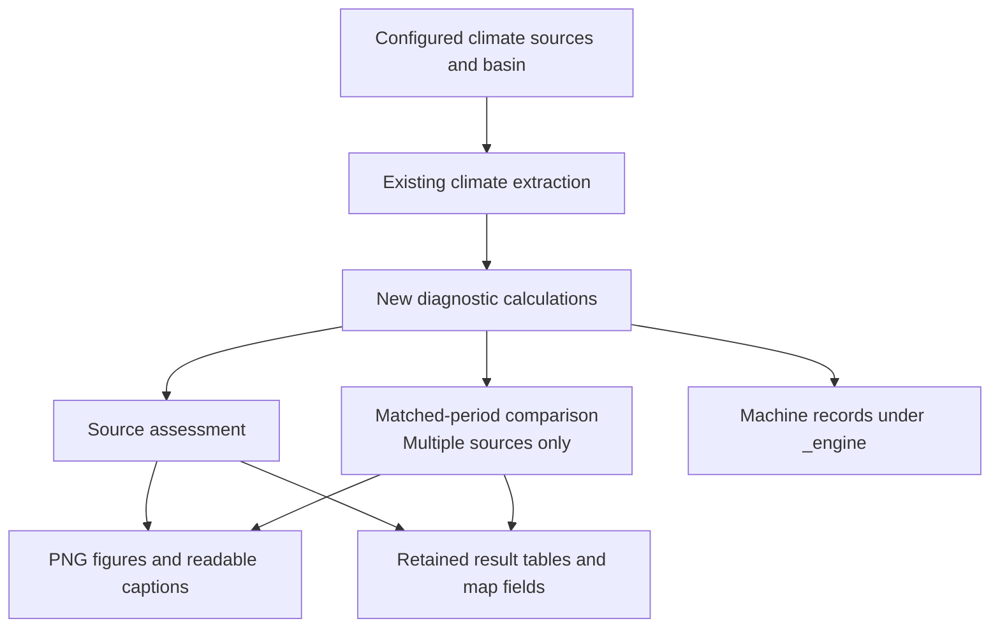

# Proposed WF0 climate diagnostics and figures

- **Status:** Gate 1 approved; implemented and locally validated.
- **Date:** 2026-10-06
- **Decision owner:** Ümit Taner

## 1. Overview

**Proposal:** replace WF0's existing plots with one climate-diagnostic system based on the WF0 lab. It uses
BlueEarth's extracted climate data and produces figures, reusable results and readable captions for each
source and comparison.

**Intent:** make historical climate and forcing differences easier to assess, including data coverage,
seasonality, extremes, drought and trends.



One source produces its own assessment. Multiple sources also produce a comparison over a common display
period, with agreement based on common valid years. The new system replaces the old WF0 plot jobs. WF1 keeps
its current plotting system.

### 1.1. What you will receive

- **Figures:** source climatology maps and temporal diagnostic PNGs. The default ERA5/CHIRPS set contains 55
  figures. No PDFs.
- **Readable captions:** `figure_captions.md`, including periods, methods, data support and scientific
  caveats.
- **Reusable results:** CSV tables and annual map fields in `tables/`.
- **Comparison summary:** `agreement.md` and its CSV table for multisource runs.
- **Optional outputs:** captioned PNG copies and subbasin figures, both off by default.
- **Machine records:** provenance and caption JSON under `_engine/`; users do not need to open these to
  interpret the figures.

The files live under each source's `diagnostics/` folder and, for multisource runs, `comparison/diagnostics/`.
The [proposed tree](#5-proposed-tree) shows the exact structure.

**Scientific status:** the lab was exercised on real Ntoum data, but its results are not scientifically
qualified. Integration does not change that.

## Contents

- [1. Overview](#1-overview)
  - [1.1. What you will receive](#11-what-you-will-receive)
- [2. Planned changes](#2-planned-changes)
- [3. Workflow architecture](#3-workflow-architecture)
  - [3.1. Rule 0.04 — Compute source diagnostics](#31-rule-004--compute-source-diagnostics)
  - [3.2. Rule 0.04b — Render source figures](#32-rule-004b--render-source-figures)
  - [3.3. Rule 0.05 — Compare sources](#33-rule-005--compare-sources)
  - [3.4. Rules being replaced](#34-rules-being-replaced)
- [4. Figure and output choices](#4-figure-and-output-choices)
  - [4.1. Source and comparison figures](#41-source-and-comparison-figures)
  - [4.2. Names and formats](#42-names-and-formats)
  - [4.3. Readable files and machine records](#43-readable-files-and-machine-records)
  - [4.4. Settings and defaults](#44-settings-and-defaults)
- [5. Proposed tree](#5-proposed-tree)
  - [5.1. Repository changes](#51-repository-changes)
  - [5.2. Generated outputs](#52-generated-outputs)
    - [5.2.1. Diagnostic tables](#521-diagnostic-tables)
    - [5.2.2. Output and naming choices](#522-output-and-naming-choices)
    - [5.2.3. Figure inventory](#523-figure-inventory)
- [6. Tradeoffs and alternatives](#6-tradeoffs-and-alternatives)
- [7. Validation and scientific limits](#7-validation-and-scientific-limits)
- [8. Gate 1 review](#8-gate-1-review)
- [9. Revision record](#9-revision-record)

## 2. Planned changes

- Replace the current WF0 figures with the lab-derived figures.
- Replace source climatology maps with the lab's native-grid map layout.
- Remove the old monthly box plots, plain annual series and comparison lines from WF0's outputs. The newer
  seasonal-band and annual-trend figures take their place.
- Keep diagnostic tables, captions and provenance alongside the figures.
- Produce PNGs only. Captioned PNG copies are optional.
- Make subbasin figures optional and off by default.

WF1 keeps its current plotting behavior. Climate extraction, WF2–WF4 and the shared plotting style remain
unchanged. Previously generated WF0 plots are not deleted automatically, but are no longer outputs of the
revised workflow.

## 3. Workflow architecture

Three rules implement the flow above. Source calculations and rendering are separate, so source figures can be
restyled without recalculation. Comparisons use retained daily source series and calculate their own
matched-period results.

### 3.1. Rule 0.04 — Compute source diagnostics

Run once per source. Calculate the basin series, coverage, climatology, extremes, SPI, drought events, trends
and method checks. Retain the tables and native-grid annual climatology fields. **Why:** retained numerical
results can be inspected and reused. Figure styling changes do not require repeating source calculations.

### 3.2. Rule 0.04b — Render source figures

Render maps and temporal figures from the retained results. Write captions with the same periods, methods and
availability information as the figures. Use shared colour bounds where figures need to be visually
comparable. **Why:** one declared inventory keeps the filenames, writers and captions consistent. A
single-source run still produces a useful assessment.

### 3.3. Rule 0.05 — Compare sources

Run only when more than one source is configured. Recalculate period-dependent diagnostics for the comparison
period. Write comparison tables, figures, captions and an agreement summary. Agreement uses common valid
years. **Why:** comparing source summaries from different periods can mislead. Retained daily series allow the
comparison to use matched periods correctly. This rule combines calculation and rendering to keep the workflow
compact; changing comparison styling therefore repeats its calculations.

### 3.4. Rules being replaced

The existing 0.04 source plot jobs and 0.05 comparison plot job are replaced by these rules. They do not run
alongside the new system. No one-source comparison job or folder is created.

## 4. Figure and output choices

### 4.1. Source and comparison figures

Temporal figures cover coverage, seasonal climate, rainfall timing, anomalies, SPI, drought events, rainfall
extremes, dry spells, persistence and trends. Two proposed additions expose SPI fit checks and trend
start-year sensitivity.

Source maps show annual precipitation, temperature and PET where supported. They use native-grid cells, basin
boundaries, river/gauge overlays, a discrete colourbar and a complete-year annotation. Subbasin boundaries can
appear on maps even when separate subbasin figures are disabled.

ERA5 provides precipitation, temperature and estimated source-grid PET maps. CHIRPS provides precipitation
only. The lab has no PET map reference; the PET map is an extension of the selected layout and needs visual
review.

For ERA5 plus CHIRPS, the default set contains **55 PNGs**: 21 ERA5 source figures, 17 CHIRPS source figures
and 17 comparison figures. Optional captioned copies add another 55 files. Subbasin opt-in adds further
products.

### 4.2. Names and formats

Keep BlueEarth's four-field filename grammar:

```text
<dataset>_<variable>_<context>_<spatial_scope>.png
```

Use `comparison` for multisource figures. Keep canonical variable names and spatial scopes. Shorten the
context to identify the diagnostic; its registered definition and caption explain the visual form. For
example:

```text
era5_precip_monthly_spi_basin_avg.png
comparison_precip_annual_trend_ts_basin_avg.png
```

**Why:** shorter names are easier to scan while retaining source, variable, diagnostic and spatial meaning.
PNG is the only required format for current use.

### 4.3. Readable files and machine records

Each diagnostic root contains:

- `figure_captions.md`: readable captions, periods, data support and caveats.
- `tables/`: retained results that can be inspected or reused.
- `figures/`: the PNGs, with optional captioned copies.
- `_engine/diagnostics.json`: settings, provenance and scientific status.
- `_engine/figure_captions.json`: caption records for automation.

**Why:** users can interpret and reuse results without opening JSON. The two JSON files remain retained
workflow records. The Markdown captions and optional caption bands are generated from the same records.

### 4.4. Settings and defaults

Settings belong in the WF0 workflow configuration file.

- `subbasin_figures: false`: basin outputs only by default. Opt-in uses the new monthly-band and annual-trend
  views, not the retired plots.
- `diagnostics.captioned_figures: false`: standard PNGs plus separate captions.
- Reference period: defaults to the requested climate window.
- Comparison period: defaults to the reference period.
- P–T comparisons: explicitly identify the temperature source. CHIRPS precipitation paired with ERA5
  temperature is never labelled as CHIRPS temperature.

Missing variables omit unsupported figures. Insufficient observations produce labelled unavailable panels and
reasons in the captions and metadata.

## 5. Proposed tree

Only affected files and folders are shown. `[new]`, `[edit]` and `[remove]` identify this implementation's
changes; `[present]` identifies its design records. Generated paths describe the output contract. Validation
results are listed in section 7.

Maintain this tree as the design and implementation change. It is the only authoritative layout view for this
task.

### 5.1. Repository changes

```text
blueearth_cst/                                           repository root
├── analyze_climate.smk                                  [edit] replace 0.04/0.05; add 0.04b and canonical targets
├── README.md                                            [edit] canonical WF0 outputs and WF1 distinction
├── blueearth_cst/
│   ├── climate_analysis/
│   │   ├── figure_naming.py                             [edit] register new controlled contexts
│   │   ├── diagnostics.py                               [new] pure diagnostic calculations
│   │   ├── diagnostic_settings.py                       [new] WF0 settings and defaults
│   │   ├── diagnostic_outputs.py                        [new] shared declaration/writer inventory
│   │   ├── diagnostic_tables.py                         [new] basin series, calculations and table I/O
│   │   ├── diagnostic_figures.py                        [new] artists using retained results
│   │   ├── diagnostic_render.py                         [new] rendering and export orchestration
│   │   ├── diagnostic_maps.py                           [new] native-grid map fields and layout
│   │   ├── diagnostic_captions.py                       [new] reusable scientific captions
│   │   ├── diagnostic_subbasins.py                      [new] optional subbasin products
│   │   ├── compute_climate_diagnostics.py               [new] rule 0.04 adapter
│   │   ├── plot_climate_diagnostics.py                  [new] rule 0.04b adapter
│   │   ├── compare_climate_diagnostics.py               [new] rule 0.05 adapter
│   │   └── compare_sources.py                           [remove] retired comparison producer
│   └── shared/
│       └── variable_registry.py                         [edit] remove obsolete producer reference in comment
├── test_case/
│   └── project_config_rapid_analyze_climate.yml         [edit] subbasin plots off by default
├── config/
│   └── templates/
│       └── project_config.analyze_climate.template.yml  [edit] optional settings and defaults
├── tests/
│   ├── test_climate_source_plot_contract.py             [edit] WF0 wiring and WF1 compatibility
│   ├── test_figure_naming.py                            [edit] new controlled contexts
│   ├── test_log_rules_contract.py                       [edit] current conditional comparison-rule description
│   ├── test_variable_registry.py                        [edit] current consumer description
│   ├── test_wf0_diagnostics.py                          [new] numerical known-answer tests
│   ├── test_wf0_diagnostic_contracts.py                 [new] adapters, maps and output contracts
│   └── test_compare_climate_sources.py                  [remove] retired producer tests
├── docs/
│   └── site/
│       └── toolbox-reference/
│           └── workflow-analyze-climate.qmd             [edit] user guide, outputs and limitations
└── dev/
    ├── reference/
    │   ├── wf0-figure-filename-rule.md                  [edit] canonical contexts
    │   └── workflows/
    │       └── rule-index.md                            [edit] new WF0 rules
    └── tasks/
        └── wf0-lab-integration/
            ├── design.md                                [present] proposal and maintained tree
            └── design-reference.md                      [present] contracts and decisions
```

WF0's legacy source/comparison plot producers are replaced. WF1 retains its existing shared source producer.
Other WF0 seed configs receive the documented settings where relevant; no additional seed is required.

### 5.2. Generated outputs

These files are generated under the user's `project_dir`, outside the toolbox repository in production.
`<store-key>` is resolved from the existing climate store specification; it is not constructed by the new
diagnostic code.

```text
<project_dir>/
└── data/
    └── climate/
        └── historical/
            ├── <store-key>/                       one existing store per declared source
            │   └── diagnostics/                   [new] source diagnostics root D_s
            │       ├── _engine/                   retained machine-readable records
            │       │   ├── diagnostics.json
            │       │   └── figure_captions.json
            │       ├── figure_captions.md
            │       ├── tables/                    shared table set detailed below
            │       │   ├── daily_basin.csv        source-only addition to shared set
            │       │   ├── annual_climatology.nc  source-only map fields
            │       │   └── subbasins/             optional canonical subbasin tables
            │       └── figures/                   source figure set detailed below
            │           ├── subbasins/             optional canonical subbasin PNGs
            │           └── captioned/             optional PNG copies, including subbasins/
            └── comparison/                        multisource runs only
                └── diagnostics/                   [new] comparison diagnostics root D_c
                    ├── _engine/                   retained machine-readable records
                    │   ├── diagnostics.json
                    │   └── figure_captions.json
                    ├── figure_captions.md
                    ├── tables/                    shared table set detailed below
                    │   ├── agreement.csv          comparison-only addition
                    │   ├── agreement.md           comparison-only addition
                    │   └── subbasins/             optional canonical subbasin tables
                    └── figures/                   comparison figure set detailed below
                        ├── subbasins/             optional canonical subbasin PNGs
                        └── captioned/             optional PNG copies, including subbasins/
```

#### 5.2.1. Diagnostic tables

Both diagnostic roots contain these 17 plot-ready tables. Source tables cover the source analysis period;
comparison tables are recomputed for the comparison display period. Source roots additionally contain
`daily_basin.csv`; comparison roots additionally contain `agreement.csv` and `agreement.md`.

```text
<diagnostics-root>/
└── tables/
    ├── coverage.csv
    ├── valid_years.csv
    ├── annual_indices.csv
    ├── monthly_values.csv
    ├── precip_climatology.csv
    ├── temp_climatology.csv
    ├── rainfall_timing.csv
    ├── spi.csv
    ├── spi_fit_checks.csv
    ├── drought_events.csv
    ├── dry_spells.csv
    ├── dry_spell_exceedance.csv
    ├── anomaly_acf.csv
    ├── trends.csv
    ├── trend_sensitivity.csv
    ├── pt_anomalies.csv
    └── homogeneity.csv
```

Unavailable table products retain their headers and have reasons in metadata.

#### 5.2.2. Output and naming choices

- Both JSON records live under each diagnostic root's `_engine/` folder. `figure_captions.md` remains at the
  root as the readable caption and interpretation reference. JSON output paths resolve from the diagnostic
  root.
- New diagnostic figures use PNG only, including optional captioned copies. No PDF files are created by the
  proposed diagnostic rules.
- WF0's old `plots/` figures are retired from workflow declarations and targets. Monthly boxes, plain annual
  series and old comparison lines are superseded by the new views. No legacy WF0 plot producer remains active.
- Source climatology maps use the lab native-grid map layout, including precipitation, genuine temperature and
  derived source-grid PET where supported. Their four-field basenames remain `annual_clim_map_basin_ext`,
  under `diagnostics/figures/`. Old files are not automatically deleted.
- `subbasin_figures` defaults to `false`. Opt-in produces canonical precipitation monthly-band and
  annual-trend views, and genuine temperature monthly-band views, using `subbasin_<id>_avg` under
  `figures/subbasins/`. Corresponding tables live under `tables/subbasins/`; captioned copies use
  `figures/captioned/subbasins/`. No old box/annual_ts plots are revived.
- WF1 retains its existing plotting contracts. Old WF0 plot consumers must use the canonical diagnostic paths;
  old comparison summaries are superseded by `tables/agreement.csv` and `tables/agreement.md` with
  matched-period semantics.
- Proposed contexts are shortened: `monthly_coverage`, `annual_timing`, `monthly_anomaly`, `monthly_spi`,
  `spi_events`, `dry_spell_exceedance`, `seasonal_anomaly`, `monthly_spi_fit`, and `annual_trend_sensitivity`.
- The four-field grammar, canonical variables, `comparison` token and `basin_avg` scope are retained. Contexts
  identify the diagnostic; their registered definitions, titles and captions specify the visual form. This
  revises the requirement to include plot form in every context for the new family and requires a
  controlled-vocabulary documentation update.
#### 5.2.3. Figure inventory

Every `.png` entry represents one explicitly declared file. `<dataset>` is the source ID for a source figure
and `comparison` for a multisource figure. Each optional captioned copy uses the identical basename under
`captioned/`.

```text
<diagnostics-root>/
└── figures/
    ├── <dataset>_precip_annual_clim_map_basin_ext.png           source only
    ├── <dataset>_temp_annual_clim_map_basin_ext.png             source only, conditional
    ├── <dataset>_pet_annual_clim_map_basin_ext.png              source only, conditional
    ├── <dataset>_precip_monthly_coverage_basin_avg.png
    ├── <dataset>_precip_monthly_clim_band_basin_avg.png
    ├── <dataset>_temp_monthly_clim_band_basin_avg.png           conditional
    ├── <dataset>_precip_annual_timing_basin_avg.png
    ├── <dataset>_precip_monthly_anomaly_basin_avg.png
    ├── <dataset>_precip_monthly_spi_basin_avg.png
    ├── <dataset>_precip_spi_events_basin_avg.png
    ├── <dataset>_precip_annual_rx1day_ts_basin_avg.png
    ├── <dataset>_precip_annual_rx5day_ts_basin_avg.png
    ├── <dataset>_precip_annual_sdii_ts_basin_avg.png
    ├── <dataset>_precip_annual_wet_days_ts_basin_avg.png
    ├── <dataset>_precip_dry_spell_exceedance_basin_avg.png
    ├── <dataset>_precip_monthly_anomaly_acf_basin_avg.png
    ├── <dataset>_precip_annual_trend_interval_basin_avg.png
    ├── <dataset>_precip_annual_trend_ts_basin_avg.png
    ├── <dataset>_precip_temp_seasonal_anomaly_basin_avg.png     conditional
    ├── <dataset>_precip_monthly_spi_fit_basin_avg.png
    ├── <dataset>_precip_annual_trend_sensitivity_basin_avg.png
    ├── subbasins/                                               optional canonical temporal views
    └── captioned/                                               optional; mirrors the selected basenames above
```

For ERA5 + CHIRPS, the new figure sets are:

| Root | Forms | PNG files | Temperature behavior |
|---|---:|---:|---|
| ERA5 source | 21 | 21 | Own temperature and own P–T |
| CHIRPS source | 17 | 17 | No temperature or own P–T figure |
| Comparison | 17 | 17 | No single-carrier temperature comparison; explicit P–T pairs use ERA5 temperature |
| Total | 55 | 55 | Optional captioned copies add another 55 files |

A single-source run creates only its source diagnostic subtree. Runtime data insufficiency produces labelled
unavailable panels for declared figures. Ntoum results remain real-data exercised and **not scientifically
qualified**.

## 6. Tradeoffs and alternatives

- **Replace rather than supplement the old plots.** One canonical system avoids duplicate views. Consumers of
  old WF0 plot paths must adopt the new diagnostic paths.
- **Retain tables rather than calculate inside every plot.** This improves inspection and rerendering, at the
  cost of additional stored files.
- **Calculate comparisons from daily series.** This supports matched-period analysis without making every
  source calculation depend on other sources. Some calculations are repeated.
- **Keep single-source outputs.** A comparison-only system would not serve runs with one source.
- **Make captioned and subbasin figures opt-in.** They support standalone sharing and local exploration
  without enlarging the default figure set.

No new dependency is expected. Detailed scientific and implementation contracts are in
[design-reference.md](design-reference.md), decisions D1–D6.

## 7. Validation and scientific limits

The integration was checked against the approved plan:

1. Numerical methods against known-answer tests and the lab's Ntoum calculations using matched inputs
   and settings.
2. Declared outputs against written outputs, including single-source, missing-variable,
   unavailable-data and subbasin opt-in cases.
3. Rendered source, comparison and map figures, including optional
   captioned variants.
4. Shared extraction/WF1 contracts and matched retained climate data.
5. The repository's required commit gates from this BlueEarth lane.

| Check | Result |
| --- | --- |
| Focused numerical and contract tests | 85 passed; final adapter rerun: 7 passed |
| CLI checks | 20 passed |
| Lint, formatting and documentation links | Passed |
| Ntoum numerical regression | Matched within the approved tolerances |
| New diagnostic jobs through Snakemake | All five passed with defaults and opt-in settings |
| Output inventory | 55 standard PNGs; opt-in case: 83 standard plus 83 captioned |

The opt-in case includes four subbasins. All recorded rendered paths exist; no PDFs were produced.
Fresh shared delineation was stopped after its last logged index read. A repeat using a local copy of that
index also remained in delineation; an independent local index read took 5.6 seconds. The precise slow
operation is unresolved. Diagnostic execution used retained
spatial and climate prerequisites, so it does not prove a fresh full-workflow run. Combined batch gates remain
due at an approved landing. Commands, numerical comparisons and results deltas are retained in the
[technical reference](design-reference.md#implementation-validation--2026-10-06).

Source agreement is not evidence of accuracy. Input homogeneity is unverified, no independent station
observations were used, and some SPI fits are unreliable. Trend results remain provisional. The detailed
scientific limitations and acceptance checks are retained in the [technical reference](design-reference.md).

## 8. Gate 1 review

Ümit Taner approved the complete revised proposal in this session. The approved design
revision is `9bed3e05`. Gate 1 covered:

- Replacement scope and retirement of the old WF0 figure producers.
- Rule organization and the calculation/rendering tradeoffs.
- The proposed tree, new files and user-level versus machine-level placement.
- Filename syntax, PNG-only output and default/optional products.
- The figure inventory, map layout and proposed PET/fit/sensitivity extensions.
- Scientific conventions, comparison periods, source attribution and limits.
- Validation and migration of consumers to the new paths.

Implementation is authorized on the current task branch. Landing, pushing and publication
remain separate decisions and are not authorized.

## 9. Revision record

- 2026-10-06: Implemented the approved canonical system; updated the tree and retained validation results.
- 2026-10-06: Gate 1 approved by Ümit Taner; toolbox-native implementation started.
- 2026-10-06: Proposed the lab integration and revised its scope with the owner.
- 2026-10-06: Rewrote this document for user review. Kept the proposed tree here; moved exact contracts,
  inspection evidence and the session decision record to `design-reference.md`.
