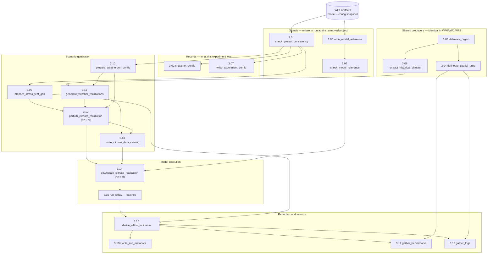

# WF3 `run_stress_test.smk` — how a stress test actually runs

Status: WORKING REFERENCE, 2026-08-15. Describes the tree at `e197502`. Companion
to `trace.md` in this folder, which measures where the time goes.

Every path is real and resolves in the shipped test project `test_case/test_rapid`
(experiment `experiment_rapid`). Shapes in the appendix were read off those files,
not inferred.

---

## The graph

Solid arrows are declared file dependencies. `⟨rlz × st⟩` marks the two rules that
fan out — one job per realization × stress-test member.

---

## How a run unfolds

### First, it checks that the experiment still belongs to this project

Before any science happens, WF3 asks whether it is still looking at the project it
thinks it is. An experiment is defined against a model that WF1 built, and if the
basin, the resolution or the model settings moved since that build, the stress test
would quietly simulate a *different catchment* and produce numbers that look fine.

**`check_project_consistency`** (3.01) reads the config snapshot WF1 left at
`config/runs/project_config_build_model.yml` and compares the `project`,
`shared.basin` and `workflows.build_model` sections against this run's. Agreement
produces two empty sentinel files — `.project_consistency_ok` in the experiment and
`.guard_ok` beside the climate store — and disagreement stops the run.

A second guard covers the model itself. **`write_model_reference`** (3.05) records
*which* built model this experiment is using, as a fingerprint derived from the
model's pointers rather than its bytes, into `config/model_reference.yml`.
**`check_model_reference`** (3.06) then refuses to proceed if that model has since
changed. Both read the model as `ancient`, which matters: a model rebuild does not
by itself re-fire the whole experiment, only a genuine change to what the model *is*.

Alongside the guards, two rules write down what this run was.
**`snapshot_config`** (3.02) copies the config as run, and
**`write_experiment_config`** (3.07) records the resolved `run_stress_test` section
with the experiment id — so months later you can answer what settings produced a
given set of results.

### Meanwhile, the shared geometry and climate are prepared

Three rules here are not WF3's own. **`delineate_region`** (3.03),
**`delineate_spatial_units`** (3.04) and **`extract_historical_climate`** (3.08)
are declared *byte-identically* in all four workflows from one shared factory.
Whichever workflow runs first builds them; the others find them up to date and skip.
That is why, in a normal pipeline run where WF1 has already run, these three do no
work at all — and why a WF3-only run against a fresh project pays for a multi-decade
climate extraction that a full-pipeline run does not.

What they produce is the basin polygon, the vector layers (basins, subbasins,
rivers, gauge locations), and the clipped climate store: `extract_historical.nc`,
which on the test project is a small daily cube of `precip`, `temp` and the
radiation and pressure fields the PET transform needs, plus `basin_cells.csv`
naming which store cells the basin actually touches.

### Then the config becomes a grid of scenarios

This is where the stress test is defined. **`prepare_stress_test_grid`** (3.09),
running `prepare_cst_parameters.py`, reads the `stress_test` block — the monthly
temperature and precipitation envelopes and their `step_num` values — and takes the
cross product of the per-axis levels. Each axis contributes `step_num + 1` levels,
so `step_num: 1` on both gives four members.

It writes each member as a small CSV of **twelve monthly rows** under
`climate/weathergenr/_work/`, and separately writes `config/stress_test_design.csv`,
the table that says which member is which. Two artifacts rather than one, because a
per-member file carries no id and cannot answer *"what is run 4?"*; both come out of
the same loop, so the enumeration that names members and the one that describes them
cannot drift apart.

Two details here cost real debugging time. Precipitation is a **multiplier** in the
member file (`1.3`) and a **percent** in the design table (`+30.0`). And there is no
member file for `st_0` — that is the reserved unperturbed baseline, and it comes
from the generator, not from perturbation.

**`prepare_weathergen_config`** (3.10) sits beside it, turning the shipped default
at `config/defaults/weathergen_config.yml` into this experiment's generator config:
the series length (anchored at 2010 and running to the horizon plus half the run
length), the water year, the dry/wet spell factors, and the `transient_change` flags.

### The weather generator makes the baselines

**`generate_weather_realizations`** (3.11) hands the climate store to weathergenr,
via the R script `generate_weather.R`. weathergenr resamples the historical record
into `RLZ_NUM` synthetic daily series that are statistically like the observed
climate without repeating it — this is the "stochastic" half of the stress test, the
part that says *this basin's weather could plausibly have gone differently*.

One job produces **all** realizations, not one job per realization. Its outputs are
`rlz_1_st_0.nc`, `rlz_2_st_0.nc`, … — `st_0` because they are unperturbed.

### Each baseline is then perturbed, once per grid point

**`perturb_climate_realization`** (3.12), running `impose_climate_change.R`, is
where the climate change actually gets imposed and where `rlz_1_st_4.nc` is born. It
reads one baseline and one member's twelve monthly rows and applies them:
temperature **additively**, precipitation **multiplicatively**, variance scaled
separately. With `transient_change: true` the perturbation ramps across the series
rather than arriving as a step on day one.

This is the fan-out point — one job per realization × member. It also carries a
`wildcard_constraints` restricting `st_num` to ≥ 1, which is load-bearing rather
than tidy: unconstrained, this rule would be a second eligible producer of
`st_0.nc`, which is also its own input, and the DAG would self-loop with
`CyclicGraphException`.

### The scenarios are catalogued, then moved onto the model grid

**`write_climate_data_catalog`** (3.13) writes a hydromt catalog with one entry per
scenario, so the next rule can address them by name rather than by path.

**`downscale_climate_realization`** (3.14) then regrids each scenario from the
climate grid onto the *wflow* grid and writes that member's run TOML. Note it runs
for every member **including `st_0`** — the unperturbed baseline is simulated too,
because it is what the two class-C month indicators are derived from.

### Wflow runs, in batches

**`run_wflow`** (3.15) runs the hydrological model over every member. Members are
grouped into batches and one Julia process runs each batch, which is why the rule
identifiers are `run_wflow_batch_<b>` and the logs are keyed by **batch id rather
than by member**. `batch_size` defaults to `ceil(members / cores)` clamped to
`batch_size_max` (8); setting `batch_size: 1` restores one job per member.

Each member produces a discharge CSV with a `time` column plus one column per
declared output — the gauge columns `Q_<id>`, and per-subcatchment columns for the
other variables.

### Finally the runs collapse into a response surface

**`derive_wflow_indicators`** (3.16) reduces every per-member run into indicator
tables, one per variable in `wflow_outvars`. Each table has the same seven columns,
and the two that matter conceptually are `temp_change` and `precip_change`: the
perturbation each member imposed, carried through as **data**. That is what closes
the loop — every point on the response surface traces back to one row of
`stress_test_design.csv`, which traces back to the `stress_test` block in the config.

Then the housekeeping: **`write_run_metadata`** (3.16b) writes a staleness sidecar,
and **`gather_benchmarks`** (3.17) and **`gather_logs`** (3.18) merge the per-rule
parts into one benchmark table and one workflow log, deleting the parts they consumed.

### What is left on disk afterwards

Almost none of the scenario chain. `temp()` covers the baselines, the perturbed
scenarios, the downscaled forcing and the warm states — so a completed run leaves
`climate/weathergenr/output/` and `hydrology/wflow/forcing/` **empty**. That is
expected, not a broken fixture; `--notemp` keeps them.

What persists is the design table, the per-member parameter CSVs, the run TOMLs, the
per-member discharge CSVs, the indicator tables, and the records.

---

# Appendix A — rule contracts and file shapes

Shapes were measured off `test_case/test_rapid`, not inferred.

| token | resolves to |
|---|---|
| `<proj>` | `project_dir` — `test_case/test_rapid` in the examples |
| `<exp>` | `<proj>/experiments/experiment_rapid` |
| `<wg>` | `<exp>/climate/weathergenr` |
| `<runs>` | `<exp>/hydrology/wflow` |
| `<store>` | `<proj>/data/climate/historical/era5_20000101_20161231` |
| `<model>` | `<proj>/models/hydrology/wflow` — built by WF1, read-only here |

### 3.01 `check_project_consistency`
Script: [`experiment/check_project_consistency.py`](../../../blueearth_cst/experiment/check_project_consistency.py)

| | path | shape |
|---|---|---|
| in | `<proj>/config/runs/project_config_build_model.yml` (`ancient`) | YAML, WF1's config snapshot |
| out | `<exp>/.project_consistency_ok` · `<store>/.guard_ok` | empty sentinels |

### 3.02 `snapshot_config`
Script: [`model/copy_config_files.py`](../../../blueearth_cst/model/copy_config_files.py) — shared with WF0/WF1/WF2

| | path | shape |
|---|---|---|
| out | [`<exp>/config/project_config_run_stress_test.yml`](../../../test_case/test_rapid/experiments/experiment_rapid/config/project_config_run_stress_test.yml) | the config as run |
| out | `<exp>/config/runs/run_record.yml` | commit, digests, env hashes |

### 3.03 `delineate_region` · 3.04 `delineate_spatial_units`
Scripts: `spatial/delineate_region.py`, `spatial/delineate_spatial_units.py`

| | path | shape |
|---|---|---|
| out | `<proj>/data/spatial/geoms/region.geojson` | Polygon, EPSG:4326 |
| out | `<proj>/data/spatial/geoms/{basins,subbasins,rivers,locations}.geojson` | vector layers |
| out | `<proj>/data/spatial/location_registry.csv` | gauge/outlet id registry |

### 3.05 `write_model_reference` · 3.06 `check_model_reference`
Scripts: [`write_model_reference.py`](../../../blueearth_cst/experiment/write_model_reference.py) · [`check_model_reference.py`](../../../blueearth_cst/experiment/check_model_reference.py)

| | path | shape |
|---|---|---|
| in | `<model>/wflow_sbm.toml`, `<model>/.outputs_configured` (both `ancient`) | |
| out | [`<exp>/config/model_reference.yml`](../../../test_case/test_rapid/experiments/experiment_rapid/config/model_reference.yml) | YAML fingerprint |
| out | `<exp>/.model_reference_ok` | `temp()` sentinel, re-evaluated every invocation |

### 3.07 `write_experiment_config`
Script: [`experiment/write_experiment_config.py`](../../../blueearth_cst/experiment/write_experiment_config.py)

| | path | shape |
|---|---|---|
| out | [`<exp>/config/experiment.yml`](../../../test_case/test_rapid/experiments/experiment_rapid/config/experiment.yml) | resolved section + experiment id |

### 3.08 `extract_historical_climate`
Script: [`climate_analysis/extract_historical_climate.py`](../../../blueearth_cst/climate_analysis/extract_historical_climate.py)

| | path | shape (measured) |
|---|---|---|
| out | `<store>/extract_historical.nc` | dims `time 6210 × latitude 4 × longitude 5`; vars `precip, temp, temp_min, temp_max, kin, kout, press_msl` |
| out | `<store>/basin_cells.csv` | 2 cols: `latitude, longitude` |

### 3.09 `prepare_stress_test_grid`
Script: [`experiment/prepare_cst_parameters.py`](../../../blueearth_cst/experiment/prepare_cst_parameters.py)

| | path | shape (measured) |
|---|---|---|
| in | the config YAML (`ancient`) | `workflows.run_stress_test.stress_test` |
| out | [`<wg>/_work/st_1.csv` … `st_4.csv`](../../../test_case/test_rapid/experiments/experiment_rapid/climate/weathergenr/_work/) | 4 cols × 12 rows: `month, temp_mean, precip_mean, precip_variance` |
| out | [`<exp>/config/stress_test_design.csv`](../../../test_case/test_rapid/experiments/experiment_rapid/config/stress_test_design.csv) | 4 cols × `ST_NUM+1` rows: `st_id, temp_change, precip_change, precip_variance_change` |

### 3.10 `prepare_weathergen_config`
Script: [`experiment/prepare_weagen_config.py`](../../../blueearth_cst/experiment/prepare_weagen_config.py)

| | path | shape |
|---|---|---|
| in | [`config/defaults/weathergen_config.yml`](../../../config/defaults/weathergen_config.yml) | shipped default |
| out | [`<wg>/config/weathergen_config.yml`](../../../test_case/test_rapid/experiments/experiment_rapid/climate/weathergenr/config/weathergen_config.yml) | series length, water year, spell factors, flags |

### 3.11 `generate_weather_realizations`
Script: [`weathergen/generate_weather.R`](../../../blueearth_cst/weathergen/generate_weather.R) — R, via `Rscript --vanilla`

| | path | shape |
|---|---|---|
| in | `<store>/extract_historical.nc`, `<store>/basin_cells.csv` (both `ancient`), the weathergen config | |
| out | `<wg>/output/rlz_<n>_st_0.nc` | **`temp()`** — gridded daily climate over the generated span |

### 3.12 `perturb_climate_realization` ⟨fan-out⟩
Script: [`weathergen/impose_climate_change.R`](../../../blueearth_cst/weathergen/impose_climate_change.R) — R

| | path | shape |
|---|---|---|
| in | `<wg>/output/rlz_{rlz}_st_0.nc`, `<wg>/_work/st_{st}.csv`, the weathergen config | |
| out | `<wg>/output/rlz_{rlz}_st_{st}.nc` | **`temp()`** — same grid as its baseline |

### 3.13 `write_climate_data_catalog`
Script: [`climate_analysis/prepare_climate_data_catalog.py`](../../../blueearth_cst/climate_analysis/prepare_climate_data_catalog.py)

| | path | shape |
|---|---|---|
| out | [`<exp>/config/catalogs/data_catalog_run_stress_test.yml`](../../../test_case/test_rapid/experiments/experiment_rapid/config/catalogs/data_catalog_run_stress_test.yml) | hydromt catalog, one entry per member |

### 3.14 `downscale_climate_realization` ⟨fan-out⟩
Script: [`experiment/downscale_climate_forcing.py`](../../../blueearth_cst/experiment/downscale_climate_forcing.py)

| | path | shape |
|---|---|---|
| in | the scenario NC, the experiment + project catalogs, `.model_reference_ok` | |
| out | `<runs>/forcing/inmaps_rlz_{rlz}_st_{st}.nc` | **`temp()`** — `(time, lat, lon)` on the model grid; vars `precip, pet, temp` |
| out | [`<runs>/config/rlz_{rlz}_st_{st}.toml`](../../../test_case/test_rapid/experiments/experiment_rapid/hydrology/wflow/config/) | run config; calendar rewritten to `standard` |

### 3.15 `run_wflow` ⟨batched⟩
Driver: Julia, `Wflow.run()` via `run_logged.py`

| | path | shape (measured) |
|---|---|---|
| out | [`<runs>/output/rlz_1_st_4.csv`](../../../test_case/test_rapid/experiments/experiment_rapid/hydrology/wflow/output/rlz_1_st_4.csv) | 14 cols: `time`, `Q_<gauge>` ×5, `aet_<subcatch>`, `gwr_<subcatch>` … |
| out | `<runs>/output/outstates_rlz_{rlz}_st_{st}.nc` | **`temp()`** — warm state, unconsumed |

### 3.16 `derive_wflow_indicators`
Script: [`experiment/export_wflow_results.py`](../../../blueearth_cst/experiment/export_wflow_results.py)

| | path | shape (measured) |
|---|---|---|
| in | every `<runs>/output/rlz_*_st_*.csv`, the `_work/st_*.csv`, the design table | |
| out | [`<exp>/results/q_indicators.csv`](../../../test_case/test_rapid/experiments/experiment_rapid/results/q_indicators.csv), `aet_`, `gwr_` … | **7 cols**: `metric, location, st_id, rlz_id, temp_change, precip_change, value` |

> `rlz_id = 0` means *pooled over realizations*; `1..RLZ_NUM` names one. Read
> `st_id` as a **string** — it is zero-padded on disk, and `pd.read_csv` without
> `dtype` turns `01` into `1` and silently breaks the join to the design table.

### 3.16b · 3.17 · 3.18 — closing records

| rule | script | out |
|---|---|---|
| 3.16b `write_run_metadata` | [`shared/write_run_metadata.py`](../../../blueearth_cst/shared/write_run_metadata.py) | [`<exp>/results/run_metadata.json`](../../../test_case/test_rapid/experiments/experiment_rapid/results/run_metadata.json) |
| 3.17 `gather_benchmarks` | [`shared/merge_benchmarks.py`](../../../blueearth_cst/shared/merge_benchmarks.py) | [`<proj>/benchmarks/wf3_benchmarks_experiment_rapid.md`](../../../test_case/test_rapid/benchmarks/wf3_benchmarks_experiment_rapid.md) |
| 3.18 `gather_logs` | [`shared/merge_logs.py`](../../../blueearth_cst/shared/merge_logs.py) | [`<proj>/logs/wf3_run_stress_test_experiment_rapid.log`](../../../test_case/test_rapid/logs/wf3_run_stress_test_experiment_rapid.log) |

Both gathers take the indicator tables as inputs, which is what schedules them last.

---

# Appendix B — fan-out arithmetic

With `RLZ_NUM = 2` and `ST_NUM = 4` (+ `st_0`, because `run_historical: true`):

| rule | jobs | scaling |
|---|---|---|
| 3.11 `generate_weather_realizations` | 1 | constant |
| 3.12 `perturb_climate_realization` | `RLZ_NUM × ST_NUM` = 8 | linear in both |
| 3.14 `downscale_climate_realization` | `RLZ_NUM × (ST_NUM+1)` = 10 | linear in both |
| 3.15 `run_wflow` | `ceil(10 / batch_size)` = 5 | linear, divided by batching |
| 3.16 `derive_wflow_indicators` | 1 | constant |

Raising both axes to `step_num: 3` gives 16 + 1 = 17 design points ⇒ 34 members: a
3.4× increase in every per-member rule. Measured cost profile: `trace.md` § 3.
